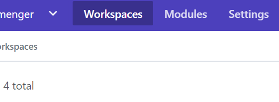

### Setup a VCS Provider reference
If you don't already have account on [Terraform Cloud](https://app.terraform.io), please create one.

When you are logged into you Terraform Cloud account select organization settings  
 

and then select VCS Providers and follow the instructions to setup a provider for the repository containing your fork of this repository.  
![click vcs providers][vcsproviders]  

### Setup a Terraform Cloud Workspace
If you would prefer to automate the provisioning of the workspaces in Terraform Cloud, please look at [this repository](https://github.com/mjmenger/terraform-cloud-workspace-provisioning) for assistance in getting that started. Otherwise, continue with the guidance below.
- Once the VCS provider is setup, show the organization Workspaces page.  
![click org settings][orgsettings]  
- On the workspaces page, select the New Workspace button.  
![click + New Workspace][newworkspace]  
- Select the vcs provider you previously configured  
![select the vcs provider][selectvcs]  
- Select the forked repository on the VCS provider  
![select the repository][selectrepo]  
- Set the configuration of the repository integration. It's suggested that you explicitly set the branch name rather than accept the default under the Advanced settings.  
![setup the repo][reposettings]  
- and click Create workspace  

[orgsettings]:doc_assets/orgsettings.png
[vcsproviders]:doc_assets/vcssettings.png
[newworkspace]:doc_assets/newworkspace.png
[vcssettings]:doc_assets/vcssettings.png
[waitingforconfig]:doc_assets/waitingforrepoconfig.png
[terraformvariables]:doc_assets/terraformvariables.png
[environmentvariables]:doc_assets/environmentvariables.png
[selectrepo]:doc_assets/selectrepository.png
[selectvcs]:doc_assets/selectvsprovider.png
[reposettings]:doc_assets/repositorysettings.png
